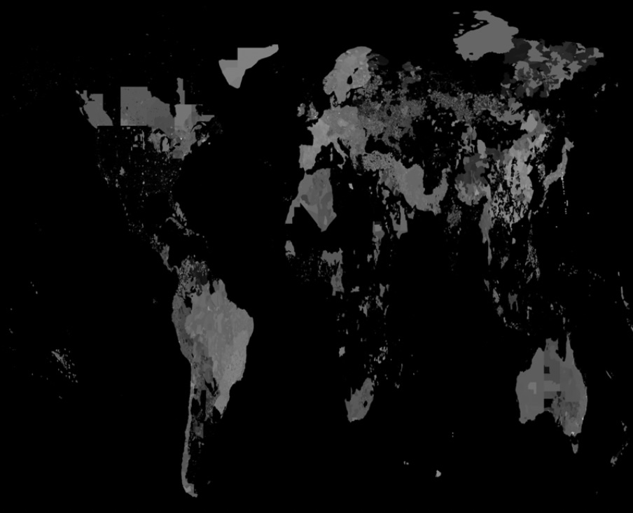
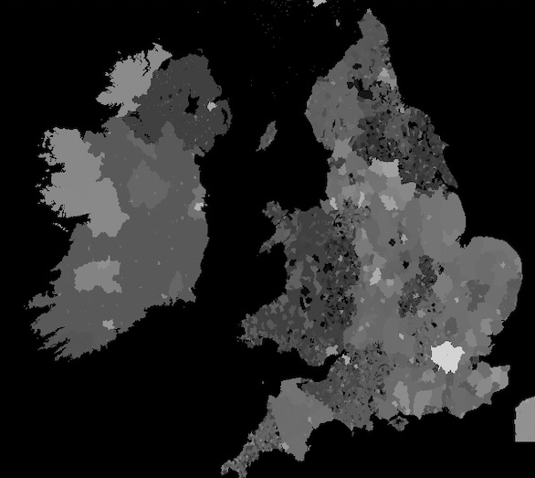

# Secondary Importance Processing

[Nominatim](https://github.com/osm-search/Nominatim/) geocoder can make use
of a so called 'secondary_importance' raster table for ranking results. See
[Importance in the Nominatim documentation](https://nominatim.org/release-docs/latest/customize/Importance).

This respository creates such a file.

## Overview

We create a Postgres raster table covering the planet with about 250m pixels
(equal to zoom level 14 of a typical OpenStreetMap). Each pixel stores an
importance score between 0 and 65535 (pixeltype 16BUI). Output is a single
`*.sql.gz` file. Optional a [GeoTIFF](https://en.wikipedia.org/wiki/GeoTIFF)
file for visualization.

All processing happens inside Postgresql database.

Input is an existing Nominatim planet database install with at least `admin`
import style and Wikipedia file import.

For each pixel in the raster we look at all places (which cover an area,
usually relations) and their importance (either from the `placex.importance`
column or calculated from the place type) and set the highest importance we
find.


## Background on ranking

Nominatim can import an optional 'secondary_importance' raster table.
https://nominatim.org/release-docs/latest/customize/Importance/ The
import features was added with
[PR 2779](https://github.com/osm-search/Nominatim/pull/2779) and
[PR 2835](https://github.com/osm-search/Nominatim/pull/2835).

A previous project in 2022 tried to use OpenStreetMap map tile views to
create a raster. See https://www.openstreetmap.org/user/tareqpi/diary/399922
One challenge was that some small websites were loading a map, for example
on their homepage, and made a region seem more popular than expected.

Secondary importance score is used when search results have otherwise same
importance, for example villages, street, parks.


## Data sizes

### Input

About 6 million places with `rank_search < 25`. 99.75% have an importance set.
There are 11385 unique importances.

```sql
SELECT count(*) FROM placex
WHERE rank_search < 25
  AND ST_GeometryType(placex.geometry) IN ('ST_Polygon', 'ST_MultiPolygon');
```

```
 rank_search |  count
-------------+---------
           2 |       63
           4 |      217
           6 |      147
           7 |        4
           8 |     3022
          10 |     5098
          11 |        4
          12 |    41279
          13 |        2
          14 |    45530
          15 |        5
          16 |   229924
          17 |    76887
          18 |   162716
          19 |   104623
          20 |   872076
          21 |    24947
          22 |  3097606
          24 |  1139306
          25 |   322725
          26 |   764490
          27 |    34801
          28 |      396
          30 | 99555017
```

### Processing time

We split the world into tiles. For each tile we lookup the places in its
extend, then group them by their importance. Each layer is then written
to a temporary table. The temporary table is then merged into a single
layer by looking at the highest pixel value.

```
tile size | time  | tiles  | with country | no places in tile
----------+-------+--------+--------------+-------------------
50x50     | 2:52h | 107584 |        33450 |             10051
100x100   | 1:57h |  26896 |         9191 |              2039
200x200   | 2:18h |   6724 |         2684 |               459
400x400   | 3:42h |   1681 |          812 |               140
```

### Output

* 8.1M `secondary_importance.sql.gz` (832M uncompressed, 99% compression)

* 21M `secondary_importance.tiff` (LZW compression, likely 512M uncompressed)

## Visualize




## Development

You can check the size of a pixel with the
https://tools.geofabrik.de/map/?type=Geofabrik_Standard&grid=1#14/69.6486/18.9507
tool.


## Further optimization

* It should be possible to exclude more tiles from processing. We
  already exclude more than 50%. Still another 30% are later seen
  empty.

* A temporary table might not be needed.

* We use ST_MapAlgebra, the expression version, which takes two raster.
  There's also ST_MapAlgebra which takes a 

* We could skip some process for a temporary table with 0 or 1 layers.

* Places might cover a full a tile. If so then any places with lower
  importance could be disregarded.